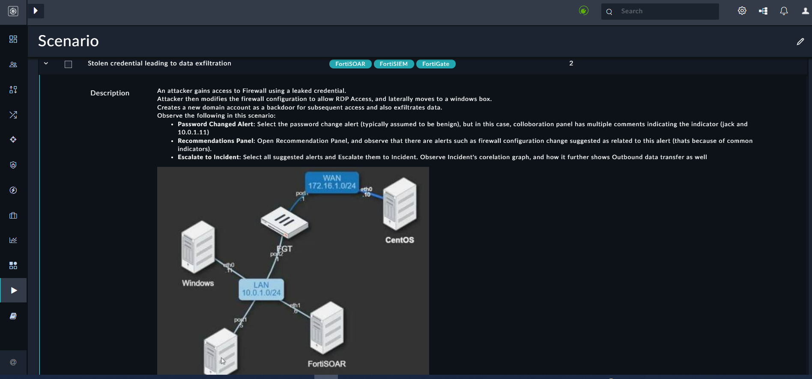
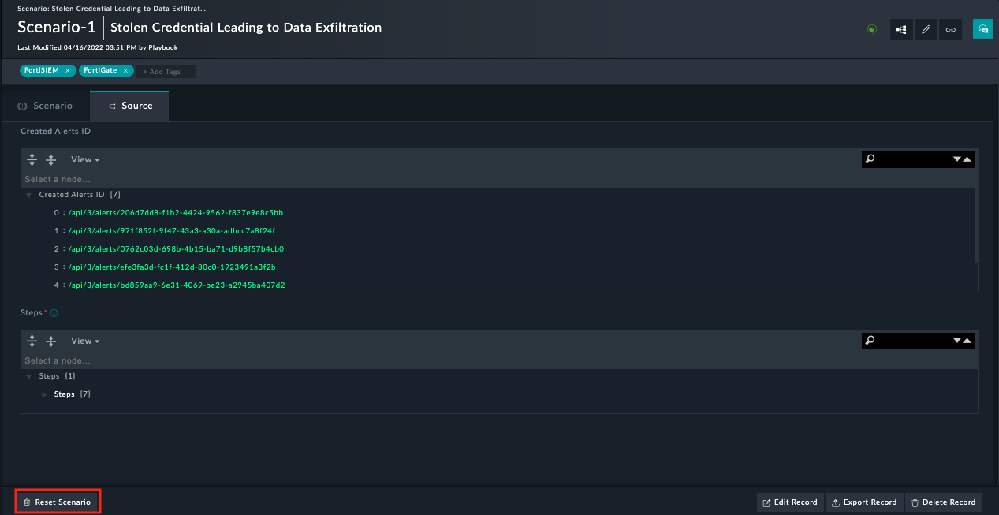

# Usage of SOC Simulator Solution Pack

## Configuring the FortiSOAR SOC Simulator Connector

This solution pack will installs and configures the FortiSOAR SOC Simulator Connector with default `demo` configuration.

## Scenario

 FortiSOAR™ can handles various scenarios as follows. Click **Simulations** to view the **Scenario** page. These scenarios can be imported through various solution packs such as Phishing Email Response, Brute Force Attack Response etc.

Some scenarios demonstrate particular features of FortiSOAR™, such as FortiSOAR™ recommendation engine which lists alerts containing similar hosts etc, providing you with a complete picture of the incident. Some scenarios demonstrate an investigation process and therefore contain associated investigation playbooks, etc.  

For example, in the Stolen Credentials scenario, click the down-arrow on the “Stolen credential leading to data exfiltration” row, and the description of this scenario is displayed:

## Simulate Scenario

There are various ways user can run a scenario simulation:

- **From Scenario Page:**
  - Click on **Simulations** to open Scenario page, select 'Stolen credential leading to data exfiltration' and click **Simulate Scenario**.

    

- **From Scenario Record:**
  - Click on **Simulations**, open 'Stolen credential leading to data exfiltration' scenario record and click **Simulate Scenario**.

    

- **From Alert Page:**
  - Click on **Incident Response**, choose **Alerts** to open Alerts page and click **Simulate Scenario** which will gives a popup

    

  - Select 'Stolen credential leading to data exfiltration' from Scenario and click 'Start Simulation' to run a scenario

    

This creates alerts and/or records corresponding to the scenario. Clicking an alert created by this scenario, for example, the “Windows User Created”, opens the alert and when you click on the Recommendations tab, you observe that many similar alerts have been created, giving you an idea that related operations are taking place, and therefore, the task of a SOC analyst to go through a number of alerts to figure out what is similar is solved by FortiSOAR™ Recommendation engine. Now, you can select all the similar alerts and link them and also escalate them to create a Security Incident.

To view the source for the Stolen credential leading to data exfiltration scenario, click **Simulations** > **Scenario** > **Stolen credential leading to data exfiltration**. Then click on the **Source** tab, the “Steps” section, contains data used by playbooks to create the demo records. Once the alerts are created their IDs are listed in the “Created Alerts” section:

## Reset Scenario

To delete the records created by this scenario, user need to follow one of the following methods:

- Click on **Simulations** to open **Scenario** page. Select a scenario 'Stolen credential leading to data exfiltration' on "Scenario" page and click the **Reset Scenario** button.

    

- Click on **Simulations** to open **Scenario** page. Open a scenario record 'Stolen credential leading to data exfiltration' and click the **Reset Scenario** button.

    
